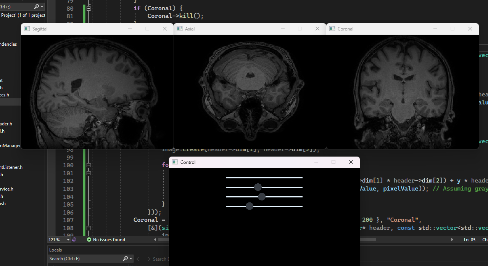

## Nifti File Reader

This project is somewhat unfinished, currently the program only works with NIFTI files stored in floats; may at some point in the future make it more universal. 

### How To Use
Files that you want to read need to be stored in a folder in the root directory called `resources`. After adding them, simply run the program and select `choose file` to open it.

### Example

